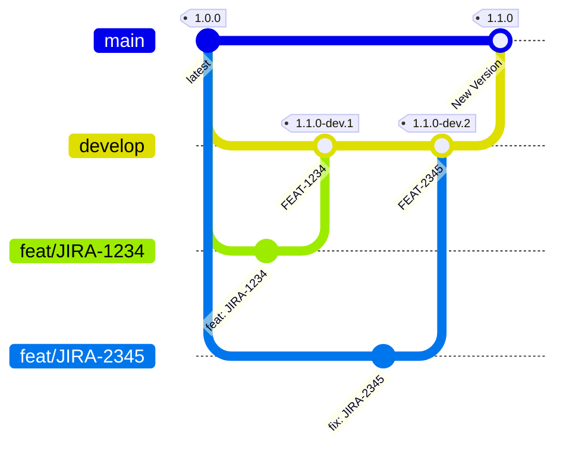
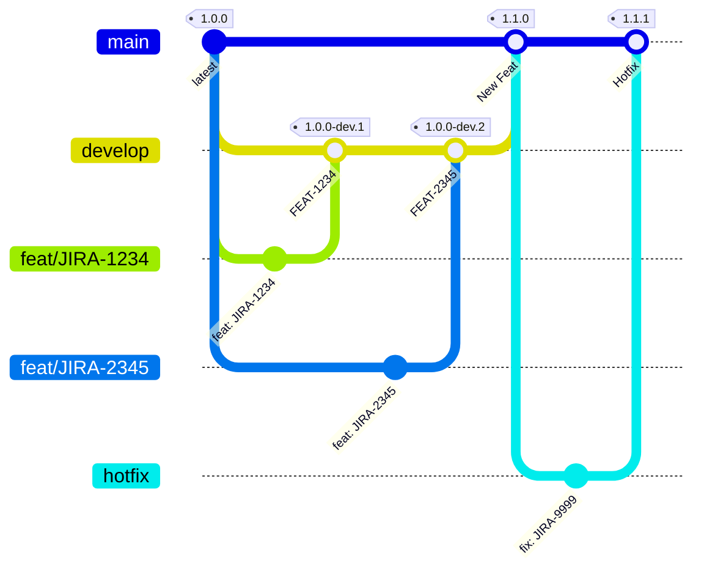

# 📍 Publish Version (semantic release)

Job ten odpowiada za ustalenie wersji aplikacji/procesu na podstawie [Conventional Commits](https://www.conventionalcommits.org/en/v1.0.0/) z użyciem aplikacji [Semantic Release](https://semantic-release.gitbook.io/semantic-release/)

---
## Jak działa job?

Job analizuje całe repozytorium to znaczy: `branches`, `merge requests`, `commits`, `tags` i na tej postawie ustala nową wersję aplikacji.

> [!warning] Ważne
> Semantic Release wersjonuje tylko na event PUSH, nie działa w przebiegu, gdy otwarty jest Merge Request

> [!warning] Wersjonowanie typu snapshot
> W sytuacji gdy `Semantic Release` nie jest w stanie określić wersji, to proces zastosuje wersjonowanie tymczasowe oparte na ostatnim tagu z `DEFAULT BRANCH` (main) + `shortCommitSHA` (przykład: `v1.0.0-02c85fa9`)

---
## **Wersjonowanie w projekcie**

W projekcie wykorzystujemy **semantic-release** do w pełni zautomatyzowanego nadawania wersji, tagowania oraz generowania changeloga. Proces opiera się na **strukturze gałęzi** `main` / `develop` / `feature` oraz na **konwencji commitów** (Conventional Commits).

---

### **1. Gałęzie w repozytorium**

1. **`main`** – zawiera stabilne wydania produkcyjne.

   * Każdy merge z `develop` powoduje wygenerowanie **pełnego release** (`1.0.0`, `1.1.0` itd.).
2. **`develop`** – zawiera kod przeznaczony do testów wewnętrznych.

   * Każdy merge z gałęzi feature powoduje wygenerowanie **pre-release** (`1.1.0-dev.1`, `1.1.0-dev.2` itd.).
3. **Gałęzie funkcjonalne (`feat/<JIRA-ID>`)** – zawierają zmiany pojedynczych funkcjonalności.

   * Nie generują wersji samodzielnie.
   * Wersja jest podbijana dopiero po merge do `develop`.

---

### **2. Jak semantic-release nadaje wersje?**

* Semantic-release analizuje **commity od ostatniego taga**.
* Na podstawie typów commitów automatycznie decyduje o nowej wersji:

  * `fix:` / `chore:` – **patch** (np. `1.0.0 → 1.0.1`)
  * `feat:` – **minor** (np. `1.0.0 → 1.1.0`)
  * `BREAKING CHANGE:` – **major** (np. `1.0.0 → 2.0.0`)
* Dla `develop` każda zmiana jest **oznaczana jako pre-release** z przyrostowym numerem dev:

  ```
  1.1.0-dev.1
  1.1.0-dev.2
  ```
* Merge `develop` → `main` tworzy pełny release:

  ```
  1.1.0
  ```

---

### **3. Przykład na podstawie diagramu**

1. **Tag `1.0.0`** istnieje na gałęzi `main`.
2. Tworzymy gałąź `develop` – kolejne zmiany są tu wersjonowane jako pre-release:

   * Merge `feat/JIRA-1234` → `develop`:
     **wersja `1.1.0-dev.1`**
   * Merge `feat/JIRA-2345` → `develop`:
     **wersja `1.1.0-dev.2`**
3. Gdy kod na `develop` jest stabilny:

   * Merge do `main` → semantic-release tworzy pełny release:
     **wersja `1.1.0`** oraz changelog.

---

### **4. Konfiguracja (.releaserc)**

```json
{
  "branches": [
    "main",
    { "name": "develop", "prerelease": "dev" }
  ],
  "plugins": [
    "@semantic-release/commit-analyzer",
    "@semantic-release/release-notes-generator",
    "@semantic-release/changelog",
    "@semantic-release/gitlab"
  ]
}
```

* Gałąź `main` generuje pełne wydania.
* Gałąź `develop` generuje pre-release z dopiskiem `-dev.X`.

---

Czy chcesz, żebym przygotował **wersję dokumentacji z diagramem w SVG/PNG**, gdzie będzie oznaczony każdy krok (merge, tag, pre-release)?
Mogę też dodać **sekcję o commitach** (wzorce `feat`, `fix` itd.) albo **schemat krok-po-kroku pipeline'u CI/CD** (np. GitLab CI). Chcesz, żeby to była **pełna sekcja "Wersjonowanie" w stylu dokumentacji technicznej projektu**?





